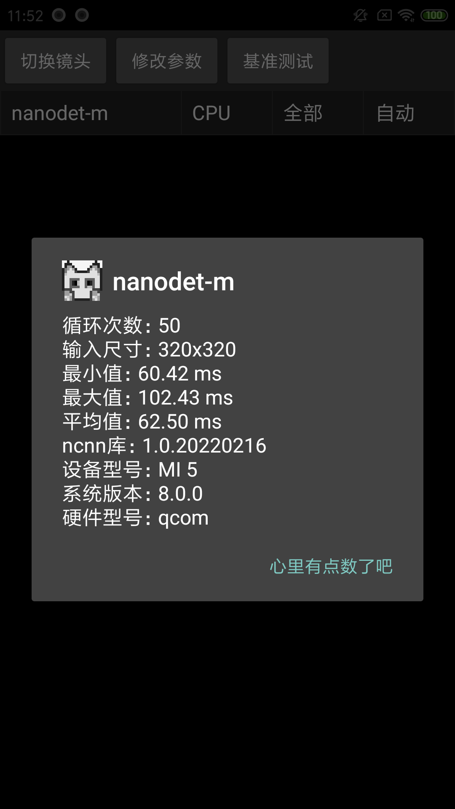
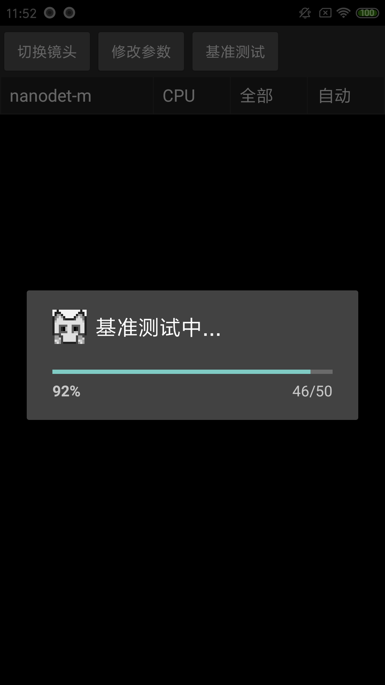
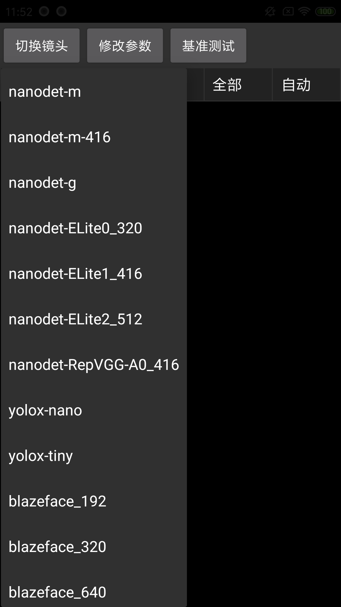
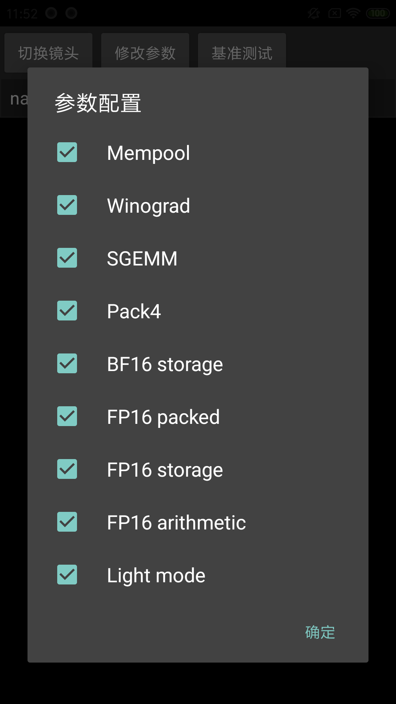

##  如果有帮助，点个star！ ##

### 移动端 ncnn 部署，摄像头实时捕获视频流进行检测。

> Android
```
从界面中选择需要测试的模型。
```
轻量级OpenCV:[opencv-mobile](https://github.com/nihui/opencv-mobile)

需要在项目 jni 文件夹中新建 opencvmobile 与 ncnnvulkan 文件夹，自己增加 ncnnvulkan 的库与 opencv-mobile 的库，目录结构大概这样。

ncnn:
```
ncnnvulkan
├─arm64-v8a
│  ├─include
│  │  ├─glslang
│  │  │  ├─Include
│  │  │  ├─MachineIndependent
│  │  │  │  └─preprocessor
│  │  │  ├─Public
│  │  │  └─SPIRV
│  │  └─ncnn
│  └─lib
│      └─cmake
│          └─ncnn
├─armeabi-v7a
...
```

opencv-mobile:
```
opencvmobile
└─sdk
    └─native
        ├─jni
        │  ├─abi-arm64-v8a
        │  ├─abi-armeabi-v7a
        │  ├─abi-x86
        │  ├─abi-x86_64
        │  └─include
        │      └─opencv2
        │          ├─core
        │          │  ├─cuda
        │          │  │  └─detail
        │          │  ├─detail
        │          │  ├─hal
        │          │  ├─opencl
        │          │  │  └─runtime
        │          │  │      └─autogenerated
        │          │  ├─parallel
        │          │  │  └─backend
        │          │  └─utils
        │          ├─features2d
        │          │  └─hal
        │          ├─highgui
        │          ├─imgproc
        │          │  ├─detail
        │          │  └─hal
        │          ├─photo
        │          │  └─legacy
        │          └─video
        │              ├─detail
        │              └─legacy
        └─staticlibs
            ├─arm64-v8a
            ├─armeabi-v7a
            ├─x86
            └─x86_64
```


:art: 截图<br/>





感谢:<br/>
- nihui
- FeiGeChuanShu
- https://github.com/Tencent/ncnn

